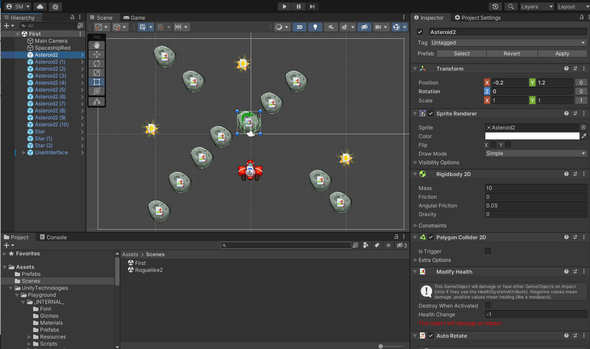
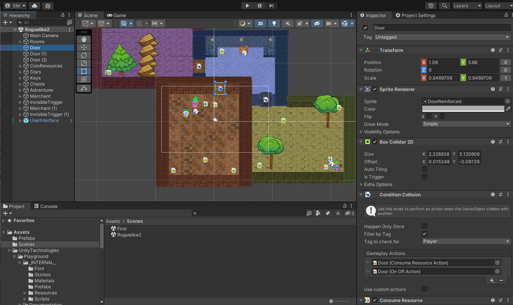

# PlayGround

## Implemented:
1) Create game from documentation Assets/UnityTechnologies/Playground/Documentation/Getting Started - Unity Playground.pdf
2) Expand the Roguelike game by creating three rooms, extra keys, extra collectibles

## Unity 2021

